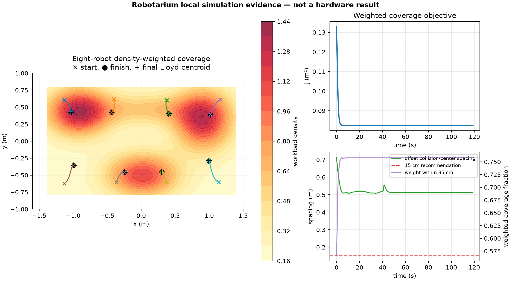

# Density-weighted multi-robot coverage for Robotarium

> **Evidence status:** local Robotarium Python Simulator only. No physical
> Robotarium run, hardware validation, account submission, or peer-to-peer
> communication claim is made anywhere in this repository.

This repository contains a deterministic eight-robot coverage-control pilot.
Each robot follows the density-weighted centroid of its discrete Voronoi cell;
the official Robotarium single-integrator-to-unicycle transform and
boundary-aware barrier certificate filter the resulting commands. A final
common actuator scale leaves margin below the platform limits documented by
Georgia Tech.

The frozen local simulation reduced the density-weighted coverage objective by
**37.96%**, from **0.133043 m²** to **0.082543 m²**, while the simulator
reported no errors or warnings. These are simulator measurements, not physical
robot results.



## Why this is a standalone repository

Only the original experiment, tests, configuration, and generated evidence are
stored here. The Georgia Tech simulator is **not copied or vendored**. Setup
fetches the [official Robotarium Python Simulator at commit
`307269846b2761528586e9c3f47d0a8bec21692f`](https://github.com/robotarium/robotarium_python_simulator/tree/307269846b2761528586e9c3f47d0a8bec21692f).
That exact dependency is the base on which the pilot was developed and the
version used for the frozen evidence.

The publication candidate was extracted without modifying `experiment.py`
from reviewed local pilot commit
`a233f3ddb350322654f800b8884571a198d9bf0b`, an unpublished descendant of the
official base. The source hash is recorded in
[`PROVENANCE.md`](PROVENANCE.md).

## Method

The operational region is a 2.84 x 1.64 m rectangle inset by 18 cm from the
published 3.2 x 2.0 m Robotarium boundary. A deterministic 45 x 27 quadrature
grid represents a nonuniform workload with a uniform floor, three unequal
Gaussian peaks, and a low ridge. Eight robots start in a fixed, well-separated
2 x 4 arrangement.

At each 0.033 s control step, the experiment:

1. obtains the eight poses through the public `get_poses()` API;
2. assigns every workload sample to its nearest robot, using lowest robot ID
   for deterministic tie-breaking;
3. computes each cell's density-weighted centroid;
4. caps nominal single-integrator feedback at 0.11 m/s and maps it to unicycle
   commands with the official Robotarium transform;
5. filters commands with the official boundary-aware unicycle barrier
   certificate, configured with a 0.15 m safety radius and 0.14 m/s magnitude
   limit; and
6. applies one common scale so requested wheel speed remains at or below
   12.0 rad/s and requested body rotation remains at or below 3.5 rad/s.

Each nominal command is defined by one robot's own Voronoi cell, but this
implementation vectorizes the partition from globally tracked poses and uses
the simulator's centralized barrier QP. It is a distributed-by-agent coverage
law implemented on a centralized testbed, **not** a peer-to-peer system.

## Frozen simulator result

The 3,600-step control phase represents 118.8 s. Including ordinary simulator
initialization, the pinned simulator reported 185.30 s of simulated execution.
The random seed is `20260817`.

| Metric | Initial | Final / worst local-simulator value |
|---|---:|---:|
| Density-weighted coverage cost | 0.133043 m² | 0.082543 m² (-37.96%) |
| Workload within 0.35 m of a robot | 56.54% | 75.91% (+19.36 points) |
| Workload within 0.50 m of a robot | 84.34% | 98.63% (+14.30 points) |
| Weighted RMS distance | 0.3648 m | 0.2873 m |
| Minimum offset collision-center spacing | - | 0.5078 m |
| Minimum reference-pose boundary clearance | - | 0.3752 m |
| Minimum conservative disk-edge boundary clearance | - | 0.3202 m |
| Maximum commanded linear speed | - | 0.1097 m/s |
| Maximum commanded angular speed | - | 3.4909 rad/s |
| Local control compute time | - | 2.99 ms p99; 4.83 ms max |
| Local simulator validation | - | no errors or warnings |

The spacing metric follows the pinned simulator's collision check: pose
references are shifted 2.5 cm forward, then measured center-to-center. It is
not an edge-to-edge body gap. The conservative boundary metric subtracts a
5.5 cm disk radius from the reference-pose clearance, based on the published
11 cm robot diameter.

The timing values above describe the machine that generated the frozen local
run; they are not hardware latency measurements and are expected to vary on
other computers. Barrier filtering changed the nominal command on 20.28% of
control steps, and the common actuator scale activated on 1.42%.

## Reproduce from a clean checkout

Prerequisites are Git and Python 3.10-3.12. The direct package versions and
official simulator commit are pinned in [`pyproject.toml`](pyproject.toml);
transitive packages retain the constraints selected by those distributions.

```bash
python3.12 -m venv .venv
.venv/bin/python -m pip install --upgrade pip
.venv/bin/python -m pip install -e '.[test]'
.venv/bin/python scripts/verify_frozen_evidence.py
.venv/bin/python -m pytest -q

mkdir -p results/reproduction
ROBOTARIUM_HEADLESS=1 ROBOTARIUM_FAST=1 \
  ROBOTARIUM_OUTPUT_DIR=results/reproduction \
  .venv/bin/python experiment.py | tee results/reproduction/simulator.log
.venv/bin/python scripts/compare_reproduction.py \
  evidence/simulator-3072698/robotarium_coverage_summary.json \
  results/reproduction/robotarium_coverage_summary.txt \
  evidence/simulator-3072698/robotarium_coverage_trajectory.npy \
  results/reproduction/robotarium_coverage_trajectory.npy
```

The comparison deliberately excludes wall-clock compute-time fields and plot
bytes. It verifies the stable controller metrics and full sampled trajectory.
The test suite also includes a short end-to-end simulator run. Continuous
integration performs the same integrity, test, and full-reproduction checks.

## Evidence files

[`evidence/simulator-3072698`](evidence/simulator-3072698) contains the frozen
local run:

- comma-delimited time-series metrics;
- sampled poses as a NumPy array with shape `361 x 2 x 8`;
- machine-readable summary JSON;
- summary figure; and
- captured simulator output.

All hashes are pinned in
[`evidence/simulator-3072698/MANIFEST.sha256`](evidence/simulator-3072698/MANIFEST.sha256).
Run the integrity checker before quoting any result.

## Hardware boundary

`experiment.py` uses only the public `get_poses`, `set_velocities`, `step`, and
`debug` methods for control. One isolated helper optionally reads the local
simulator's private `_errors` dictionary for evidence reporting. If a hardware
runtime omits it, validation is marked unavailable rather than falsely reported
as zero; control and file generation do not depend on it.

The pinned 2024-11-20 guide uses the older `call_at_scripts_end()` name, while
the pinned simulator source exposes `debug()` and its examples use `debug()`.
This project follows the tested pinned source. Confirm the live runtime before
any future upload.

A physical run requires a separately approved Robotarium account and submission.
After a real run, preserve the returned script, settings, logs, data, and video;
verify them independently before adding any hardware claim. Until that happens,
the accurate description is **Robotarium-ready local simulation**.

## Official references

- [Robotarium Get Started](https://www.robotarium.gatech.edu/get-started)
- [Robotarium FAQ](https://www.robotarium.gatech.edu/faqs)
- [Pinned official Python simulator](https://github.com/robotarium/robotarium_python_simulator/tree/307269846b2761528586e9c3f47d0a8bec21692f)
- [Pinned official Python guide](https://github.com/robotarium/robotarium_python_simulator/blob/307269846b2761528586e9c3f47d0a8bec21692f/Robotarium_Python_Guide.pdf)

See [`NOTICE.md`](NOTICE.md) for dependency attribution and license boundaries.
This project is independent and is not endorsed by or affiliated with Georgia
Tech or the Robotarium organization.

## License

Original project files are released under the MIT License; see [`LICENSE`](LICENSE).
No third-party package is redistributed here. Installed dependencies retain
their own licenses, including CVXOPT's GPL-3.0-or-later terms; see
[`NOTICE.md`](NOTICE.md).
